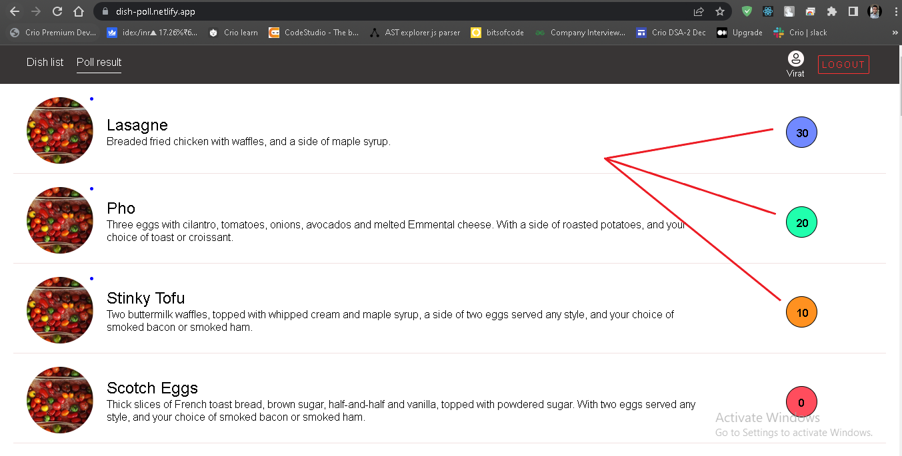

<h1>DishPoll Application By Ramesh Suthar</h1>

<h3>Link: </h3><a href="https://dish-poll.netlify.app/">Hosted-Link</a>

<h3>Tools used</h3>

<ol>
<li>React</li>
<li>Redux Toolkit</li>
<li>React Router</li>
</ol>

<h3>Steps to run the project</h3>

<ol>
    <li>Download the project from the respository.</li>
    <li>Extract the .zip file.</li>
    <li>Use any Editor of your choice and open the folder containing all files.</li>
    <li>Make sure you have NPM installed</li>
    <li>Open terminal in the folder's directory and run "npm install". Wait for files to get downloaded.</li>
    <li>now run "npm install" command to install all the dependencies used in this project</li>
    <li>now use "npm start" command to locally run project.</li>
</ol>

<h3>Points covered in the project</h3>

<ol>
    <li>
    
Logging in/Logging out. For username and password, kindly refer src/redux/feature/usersDataSlice.js.js

    <ol>
    <li>username: virat, password: kohli</li>
    <li>username: dhoni, password: singh</li>
    <li>username: rohit, password: sharma</li>
    <li>username: pandhya, password: hardhik</li>
    <li>username: jadeja, password: ravindra</li>
    </ol>
    
    </li>
    <li>
    
 The details of the current logged in user will be displayed at the right top corner.
    

    
    </li>
    <li>
    
 Once you successfully login, the home page will open with default tab as Dish List. which list all the dishes.
    

    
    </li>
    <li>
    
 Each dish will have 3 preference number, user will have an option to select upto three dishes and can give the preference number as 1, 2 or 3. The dish with preference number 1 will have 30 points. The dish with preference number 2 will have 20 points and The dish with preference number 3 will have 10 points. 
    

    
    
    </li>
    <li>
    
 After successful polling, the user can check the polling result on "poll result" tab.
    

    
    </li>
    <li>
    
 You can perform polling for other users. By clicking on the logout button as shown in the image below. Logging in again using any of the credentials in point 1.
    

    
    </li>
    <li>
    
 Now to understand polling results,
        <ol>
        <li>The Blue color score on a dish denotes the dish that got most points</li>
        <li>The Light Green color score on a dish denotes the dish that got most 2nd points</li>
        <li>The Orange color score on a dish denotes the dish that got 3rd most points</li>
        <li>One more thing to note, the blue color dot at the top right corner in the dish image denote the rows for which the current logged in user voted. The icon is an indication for the user to note where his dishes are in the list. 
        </li>
        </ol>
    

    
    </li>
    <li>
    

    For understanding the objective of the project, please refer this link <a href="https://github.com/syook/react-dishpoll">Click here</a>
    

    </li>
</ol>
